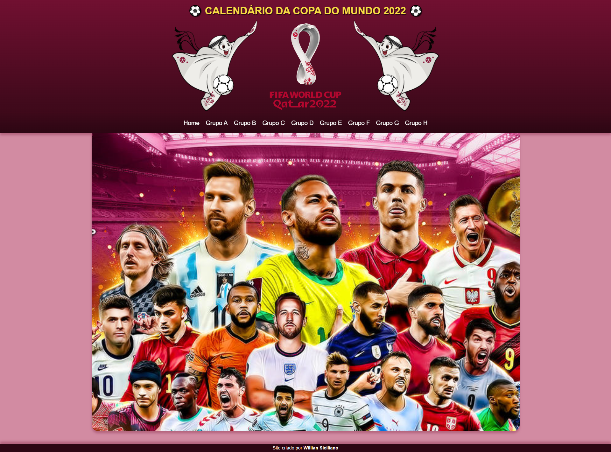
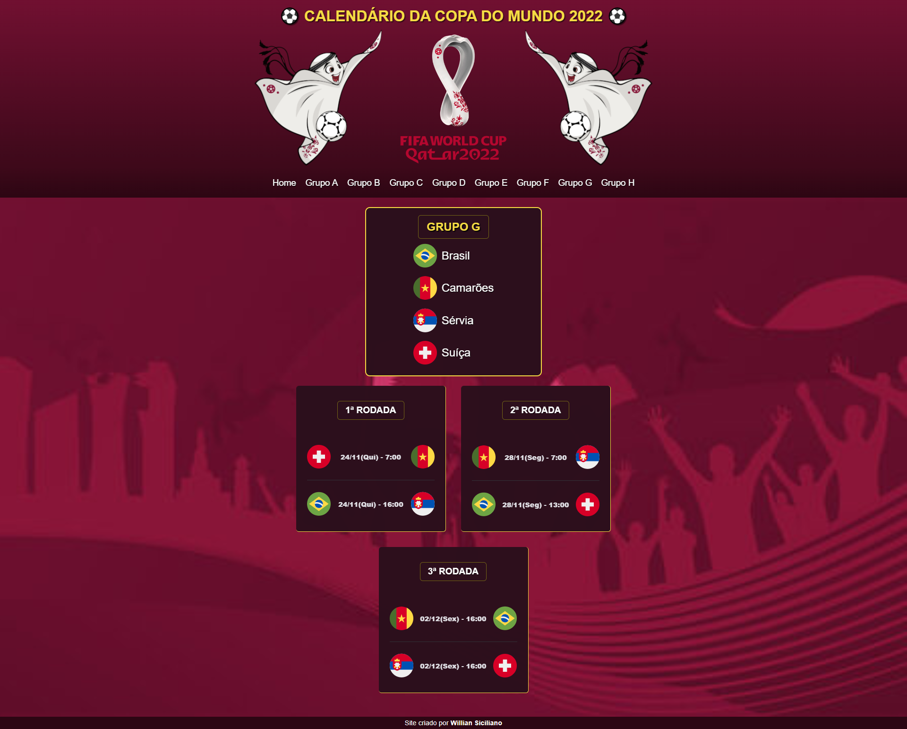

<h1 align="center"> Projeto Calendário da Copa do Mundo de 2022 da FIFA </h1>

Baseado no Evento "Next Level Week", promovido pela Rocketseat.

  <a href="#-tecnologias">Tecnologias</a>&nbsp;&nbsp;&nbsp;|&nbsp;&nbsp;&nbsp;
  <a href="#-projeto">Projeto</a>&nbsp;&nbsp;&nbsp;|&nbsp;&nbsp;&nbsp;
  <a href="#memo-licença">Licença</a>

ACESSE O SITE <a href="https://williansiciliano.github.io/projeto-calendario-copa-2022/" target=_blank>CLICANDO AQUI</a>!

  

 

  

  

## ⚙️ Tecnologias

Este projeto foi desenvolvido utilizando as seguintes tecnologias:

- HTML e CSS
- JavaScript
- Git e Github

## 💻 Projeto

O Calendário da Copa do Mundo é um projeto que exibe o calendário de jogos da Copa do Mundo de 2022 da FIFA.

## 📝 Licença

Esse projeto está sob a licença MIT.
